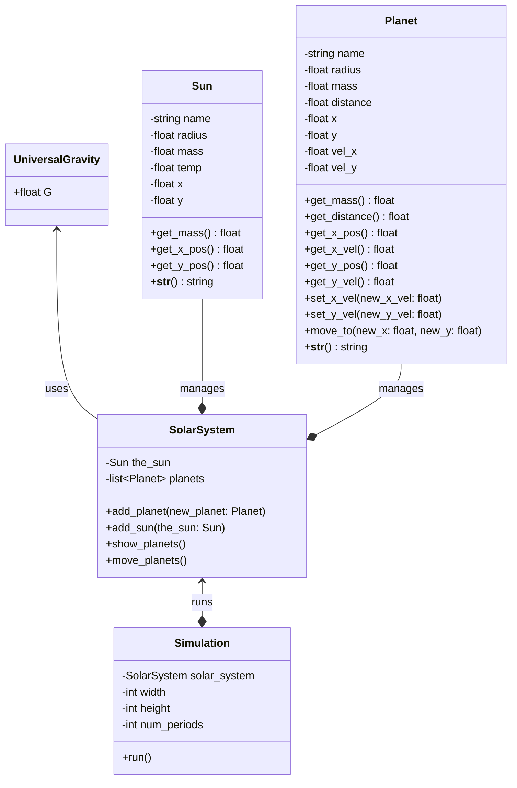

# Planets in Space

## Part 1 - English to Code

* In this part, we are going to learn to translate written English into the classes and objects that we'll need to build. Read the Paragraph below, and write down all the **NOUNS**, then re-read the paragraph and write down all the **ADJECTIVES**, and finally select all the **VERBS**. When done, move on to **Part 2**.

* Alternatively, you could ask your friendly AI Virtual Assistant to perform the mundane task for extracting the **NOUNS**, **VERBS**, and **ADJECTIVES** for you, but make sure you can verify its results!

---

I want you to create a solar-system simulation where you can add planets and, of course, a sun. The simulation should be able to move the planets with respect to the sun's mass and size and, of course, gravity. The simulation should also be able to show where each planet is located at any given period. The Sun should be the center of the solar-system, so coordinate (0.0, 0.0). Each Planet should also have a coordinate position (hopefully not at 0.0, 0.0), a mass and size, and at any point I want to know its distance from its sun. Lastly, because this is a simulation, we should be able to move the planet and get and set its position and velocity.

---

## Part 2 - Class/Object Determination

* From your extraction of **NOUNS**, **ADJECTIVES**, and **VERBS** from the paragraph in Part 1, decide what classes, objects, and actions are necessary for our simulation to satisfy all requirements.

1. Nouns -> Become your classes and objects.
2. Adjectives -> Become the instance variables/attributes of your classes and objects.
3. Verbs -> Become the actions / methods of your classes and objects.

* From past class discussions, here is an example of the parts of speech extracted from the paragraph above.

| Nouns        | Adjectives          | Verbs |
| :---         | :----:              | ---:  |
| Planet       | mass                | move  |
| Simulation   | distance            | set   |
| Solar System | position/coordinate | get   |
| Sun          | velocity            | add   |
| Gravity      | name                | show  |

* From the noun extraction, you will create Python classes for: Planet, Sun, Solar_System, and Simulation
* When you apply the adjectives to the nouns they describe and/or look for object relationships in the nouns, you'll end up with something like this:
    * Planet: name, mass, distance, position (x, y), velocity (x, y)
    * Sun: name, mass, position (x, y)
    * Solar System: the_sun, planet(s)
    * Simulation: a_solar_system, the_sun, planets

* Finally, when you apply the verbs to the nouns performing the actions you'll end up with something like this:
    * Planet: move, get/set position (x, y), get/set velocity (x, y)
    * Sun: get/set position (x, y), get mass
    * Solar System: add planet/sun, show planets, move planets

* From this simple English-parts to Object breakdown, a bit of discussion should lead to UML that looks a bit like this:
    * View this mermaid graph by pasting it into [Mermaid Live](https://mermaid.live/)



<object data="solarsystemsim.svg" width="700" height="700"> </object>


## Part 3 - Implementation

* From the plan created in Part 2, implement the classes and methods necessary for our simulation.
* When you get to the SolarSystem move_planets method you may use the following implementation as your guide
    * BE CAREFUL: your sun might not be named the_sun and other attributes or methods may be named differently, so you'll need to accomodate for mismatches in naming.
```python
    def move_planets(self):
        dt = .001  # Constant time interval for each solar system iteration.

        for planet in self.planets:
            # Move the distance covered in the interval dt
            planet.move_to(
                planet.get_x_pos() + dt * planet.get_x_vel(),
                planet.get_y_pos() + dt * planet.get_y_vel())

            # After move we need to calculate the new distance from the sun using the distance formula.
            dist_x = self.the_sun.get_x_pos() - planet.get_x_pos()
            dist_y = self.the_sun.get_y_pos() - planet.get_y_pos()
            new_distance = math.sqrt(dist_x**2 + dist_y**2)

            # Let's calculate our new acceleration so we can set our new velocity
            acc_x = U.G * self.the_sun.get_mass()*dist_x/new_distance**3
            acc_y = U.G * self.the_sun.get_mass()*dist_y/new_distance**3

            # Now let's calculate the new x and y velocities and update them for the planet
            planet.set_x_vel(planet.get_x_vel() + dt * acc_x)
            planet.set_y_vel(planet.get_y_vel() + dt * acc_y)
```
* Do your best to understand how this method works. I will release a video later in the week explaining exactly what it does and the mathematics behind it, but I want you to try to interpret it before my reveal.

## Part 4 - The Simulation

* Below is an example main module running my simulator. If you've followed the lab this far, the following main method should work and start printing details about your planet orbits:
    * You may need to change class and method names to match your implementation.
```python
if __name__ == '__main__':
    solar_system = SolarSystem()

    the_sun = Sun("SOL", 5000, 10000000, 5800)
    solar_system.add_sun(the_sun)

    earth = Planet("EARTH", 47.5, 1, 25, 5.0, 200.0, "green")
    solar_system.add_planet(earth)

    mars = Planet("MARS", 40.5, .1, 62, 10.0, 125.0, "red")
    solar_system.add_planet(mars)

    simulation = Simulation(solar_system, 500, 500, 2000)
    simulation.run()
```

## Extra Credit - (25 pts)

* Modify your code and classes to use the turtle library to simulate the planetary motion.

## Part 5 - Turn In

* Do the same thing you do every week!